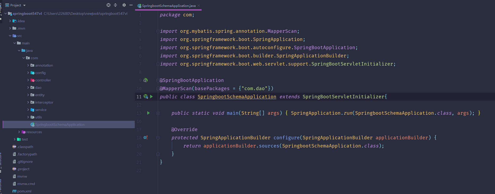

# 基于SpringBoot的网上订餐系统

#### 介绍
本网上订餐系统，以Spring Boot框架为核心，打造了一个功能丰富、操作便捷的在线订餐平台。它不仅为餐饮商家提供了从会员、菜品、订单到配送等全方位的管理功能，也为广大用户带来了直观、便捷的订餐体验。通过先进的技术支持和人性化的设计，本系统旨在促进餐饮业数字化转型，提升服务质量和效率。

#### 技术栈介绍

后端技术栈：Springboot+Mysql+Maven

前端技术栈：Vue+Html+Css+Javascript+ElementUI

开发工具：Idea+Vscode+Navicate

#### 系统功能介绍

会员管理：系统支持会员信息的全面管理，包括新增、编辑、删除会员信息，以及会员等级、积分、消费记录等详细资料的查询与管理。

菜品分类与信息管理：商家可以轻松创建、修改、删除菜品分类，并对菜品信息进行详细编辑，如名称、价格、图片、描述等，确保菜品信息的准确性和完整性。

订单信息管理：系统提供完整的订单管理功能，包括订单列表查询、订单详情查看、订单状态处理（如确认、拒绝、完成等），以及订单数据的统计分析。

订单配送管理：支持配送员的信息录入、状态查询和任务分配，实现配送进度的实时跟踪和查询，确保订单及时送达。

管理员管理：系统允许管理员创建新的管理员账号，并分配相应的权限，同时提供管理员登录日志查询和操作监控功能，确保系统安全。

系统管理：涵盖系统参数设置（如营业时间、支付方式、税率等）、数据备份与恢复、日志管理与系统监控等功能，确保系统的稳定运行和安全性。

菜品信息：用户可以通过直观的界面浏览各类菜品，并使用搜索功能快速找到心仪的菜品。

个人中心：用户可以在个人中心查看和编辑个人信息，管理账户余额、历史订单等，享受个性化的服务。

订单管理：用户可以将喜欢的菜品加入购物车，进行数量修改、删除等操作，并随时提交订单进行支付。系统还提供订单状态查询和跟踪功能，方便用户随时了解订单情况。

配送管理：用户可以在下单时选择配送地址和配送时间，系统会根据用户的选择进行配送任务的分配和调度。用户还可以实时查看配送进度，确保订单准时送达。

#### 系统功能截图

代码结构图

数据库表图

登录

首页

菜品信息

订单信息管理

会员信息管理

订单配送管理

菜品分类管理

菜品信息管理

系统管理

#### 总结

本网上订餐系统凭借其先进的技术架构、丰富的功能设计和人性化的操作体验，为用户提供了全方位的订餐服务。同时，也为餐饮商家提供了高效的管理工具和运营支持，推动了餐饮业的数字化转型和升级。无论是用户还是商家，都能在本系统中享受到便捷、高效、安全的服务体验。

#### 使用说明
创建数据库，执行数据库脚本 修改jdbc数据库连接参数 下载安装maven依赖jar 启动idea中的springboot项目

后台地址：http://localhost:8080/springboot547vl/admin/dist/index.html

管理员  abo 密码 abo

前台地址：http://localhost:8080/springboot547vl/front/index.html
